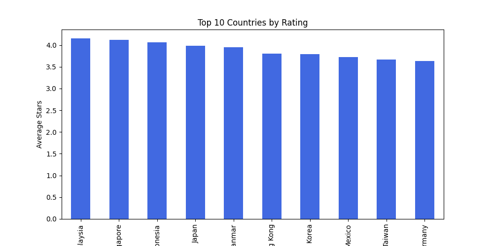
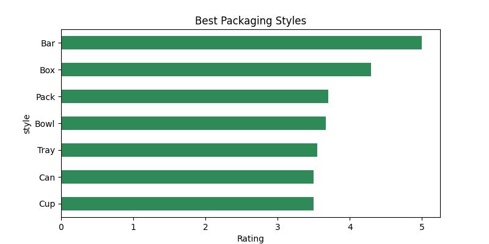
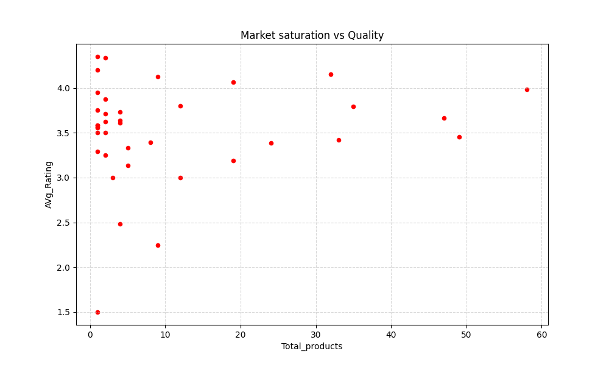

# Global Ramen Ratings Analysis 🍜

## Project Overview
This project analyzes a dataset of ramen ratings from around the world to discover market trends, brand performance, and consumer packaging preferences.

## 1. Top Countries by Rating
This chart shows the top 10 countries based on their average ramen quality.

## 2. Best Packaging Styles
Analysis of which packaging styles (Pack, Bowl, Cup) receive the highest ratings from consumers.

## 3. Market Saturation & Performance
A scatter plot showing the relationship between the number of products and average ratings per market.

## Technical Highlights
The analysis was performed using **Python** and **Pandas**. Key steps included:
- **Data Cleaning:** Handling missing values and formatting string columns.
- **Aggregation:** Grouping data by country and style to calculate mean ratings.
- **Visualization:** Creating professional charts using **Matplotlib**.

---
*You can find the full analysis script in the `ramen_analysis.py` file.*
